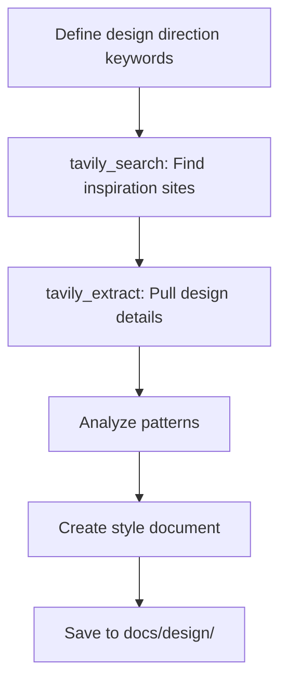

# Design Research

Research and document modern creative website designs using Tavily MCP. Extracts comprehensive style specifications from award-winning sites, agency portfolios, and design showcases.

## When to Use

- Researching design inspiration for a new project
- Creating style guides or design systems
- Analyzing creative website trends
- Documenting aesthetic directions before implementation
- Finding unique typography, color, and motion patterns

## Workflow Overview



---

## Phase 1: Define Keywords

Before searching, define your design direction. Be specific about the aesthetic you're targeting.

### Keyword Categories

| Category | Example Keywords |
|----------|------------------|
| **Aesthetic** | brutalist, minimalist, maximalist, editorial, luxury, playful, retro-futuristic |
| **Industry** | agency, portfolio, SaaS, e-commerce, startup, creative studio |
| **Element** | hero section, navigation, footer, pricing, about page, case study |
| **Style** | dark mode, bold typography, kinetic, animated, monochrome, vibrant |
| **Award** | Awwwards, FWA, CSS Design Awards, Webby, site of the day |

### Keyword Combination Template

```
"[aesthetic] + [industry] + website + [year]"
"[element] + design + inspiration + [style]"
"Awwwards + [aesthetic] + site of the day"
"best + [industry] + websites + [year]"
```

---

## Phase 2: Search for Inspiration

Use `tavily_search` to discover creative websites.

### Search Patterns

**Find award-winning sites:**
```
tavily_search:
  query: "Awwwards site of the day [aesthetic] 2026"
  max_results: 10
  search_depth: "advanced"
  include_images: true
```

**Find specific styles:**
```
tavily_search:
  query: "brutalist web design portfolio examples"
  max_results: 10
  include_images: true
```

**Find typography inspiration:**
```
tavily_search:
  query: "bold typography website design [industry]"
  max_results: 10
  include_images: true
```

**Find motion/animation:**
```
tavily_search:
  query: "animated website scroll effects creative"
  max_results: 10
  search_depth: "advanced"
```

For more search patterns, see [search-queries.md](search-queries.md).

---

## Phase 3: Extract Design Details

Use `tavily_extract` to pull specific design information from found URLs.

### Extract Landing Pages

```
tavily_extract:
  urls: ["https://site1.com", "https://site2.com"]
  extract_depth: "advanced"
  include_images: true
  query: "design style colors typography layout sections"
```

### Extract with Focus Areas

**Typography focus:**
```
tavily_extract:
  urls: ["..."]
  query: "font family typography headings body text"
  include_images: true
```

**Color focus:**
```
tavily_extract:
  urls: ["..."]
  query: "color palette primary accent background"
  include_images: true
```

**Layout focus:**
```
tavily_extract:
  urls: ["..."]
  query: "layout grid sections hero navigation footer"
  include_images: true
```

---

## Phase 4: Analyze & Document

Create a comprehensive style document following this structure.

### Style Document Template

```markdown
# [Style Name]

## Summary

[2-3 sentence description of the aesthetic. What makes it distinctive? What feeling does it evoke?]

## Style

[Detailed description of the overall aesthetic. Include references to design movements, inspirations, and key characteristics.]

### Spec

[Technical specification for implementing this style. Be precise with values.]

- **Typography**: [Font pairings, weights, sizes, tracking, line-height]
- **Color Palette**: [All colors with hex values and usage]
- **Borders**: [Border styles, widths, colors]
- **Motion**: [Animation types, durations, easing]
- **Interactions**: [Hover states, click feedback, transitions]

## Layout & Structure

[Overview of the spatial composition and page structure.]

### [Section Name 1]

[Detailed description of the section including positioning, content, and styling.]

### [Section Name 2]

[Continue for each major section...]

## Special Components

### [Component Name]

[Purpose and visual description]

[Detailed implementation spec including sizing, colors, animations, and interactions.]

## Special Notes

MUST: [Critical requirements that define this style]
DO NOT: [Anti-patterns that break the aesthetic]
```

---

## Phase 5: Save Documentation

Save completed style documents to `docs/design/[style-name].md`.

### File Naming

- Use lowercase with hyphens: `kinetic-orange.md`, `swiss-minimal.md`
- Include date if research is time-sensitive: `brutalist-trends-2026.md`

### Documentation Structure

```
docs/
  design/
    [style-name].md         # Individual style documents
    research-log.md         # Optional: Log of research sessions
    inspiration-sources.md  # Optional: Curated list of sites
```

---

## Complete Example

### Research Goal
Find bold, kinetic typography styles for a portfolio site.

### Step 1: Search
```
tavily_search:
  query: "Awwwards kinetic typography portfolio 2026"
  max_results: 10
  include_images: true
  search_depth: "advanced"
```

### Step 2: Extract from top results
```
tavily_extract:
  urls: [
    "https://example-agency.com",
    "https://designer-portfolio.com"
  ]
  extract_depth: "advanced"
  include_images: true
  query: "typography animation colors layout hero section"
```

### Step 3: Analyze patterns
- Font: Heavy display fonts (Archivo Black, Bebas Neue)
- Color: High contrast (orange/black, white accents)
- Motion: Marquee text, rotating elements
- Layout: Full-width sections, skewed dividers

### Step 4: Create style document
See [output-templates.md](output-templates.md) for the full output example.

---

## Quick Reference

### Tavily Tools

| Tool | Use For |
|------|---------|
| `tavily_search` | Discover sites, find trends |
| `tavily_extract` | Pull detailed content from URLs |
| `tavily_crawl` | Explore site structure |

### Output Locations

| Document | Location |
|----------|----------|
| Style specs | `docs/design/[style-name].md` |
| Research logs | `docs/design/research-log.md` |
| Inspiration lists | `docs/design/inspiration-sources.md` |

### Additional Resources

- [search-queries.md](search-queries.md) - Keyword strategies and search patterns
- [output-templates.md](output-templates.md) - Full output examples
